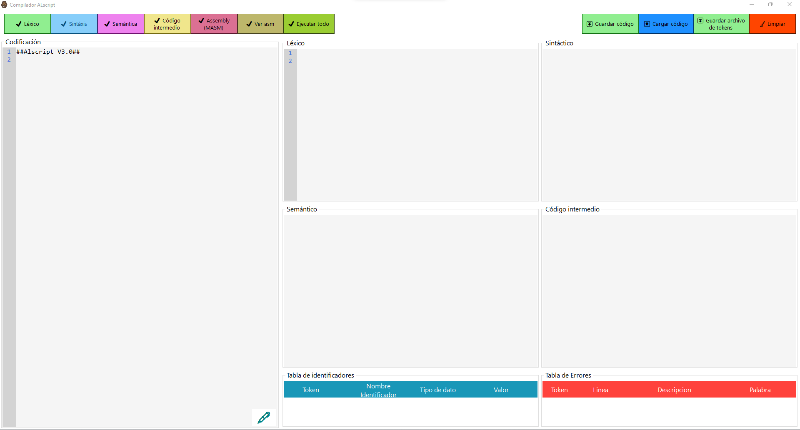
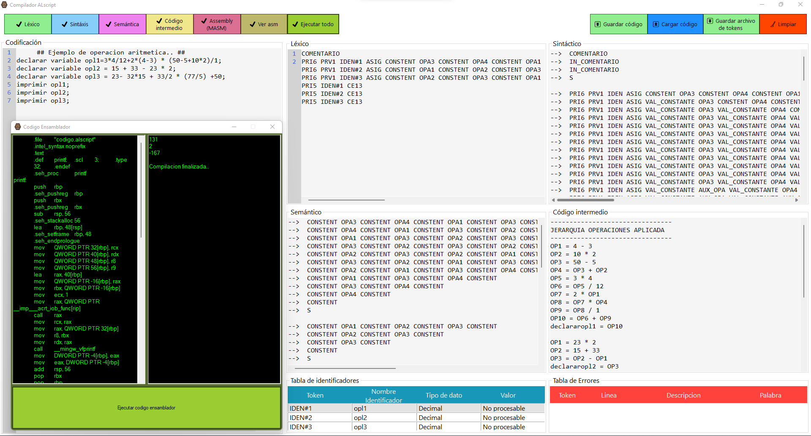

# ALScript-1.0  

  

  

    Repositorio contenido del compilador ALscript, incluye todas las fases del analizador/programa objeto.

   

#### Propósito de ALScript
    El propósito de ALScript es ser un lenguaje sencillo, un lenguaje de paradigma estructurado, que sea fácil de utilizar para programadores que hablen español.

#### Fases que contiene. Ultima actualizacion: 28 noviembre 2022.
- ***Analizador lexico*** - Conversion de lenguaje a archivo de tokens.
- ***Analizador sintactico*** - Reducciones mostradas paso a paso.
- ***Analizador semantico*** - Reducciones mostradas paso a paso.
- ***Generacion de cogido intermedio*** - Para operaciones aritmeticas, demostracion de jerarquia aplicada.
- ***Generacion y ejecucion e codio ensamblador*** - Para op. ar. y E/S, muestra de codigo y resultados.

#### Desarrollado por
- Alan Castro
- Alan Peña
- Angel Salazar
- Humberto Diaz

#### Vista previa de la interfaz diseñada

  

 

#### Ejemplo de aplicacion funcional

  

 
